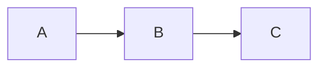

<!--
README for the omni-markdown project
-->
# Omni Markdown

> Android Studio plugin for rendering markdown with diagrams like mermaid 


<!-- Badges (replace with real services) -->


## Table of Contents

- [About](#about)
- [Roadmap](#roadmap)
- [Contact](#contact)

## Features

- Split-view editor: text on the left, rendered preview on the right
- Live preview with 300ms debounce — updates as you type
- Mermaid diagram rendering via bundled `mermaid.js v11.12.0`
- Fully offline — no CDN dependency

## Requirements

- Android Studio Otter 2025.2.1 (`#AI-252.25557.131.2521.14432022`)
- Java 21
- JCEF support enabled in the IDE

## Build

```bash
./gradlew buildPlugin
```

Output: `build/distributions/md-mermaid-preview-1.0.0.zip`

## Run in sandbox IDE

```bash
./gradlew runIde
```

## Install in Android Studio

1. Build the plugin: `./gradlew buildPlugin`
2. Open Android Studio → Settings → Plugins → ⚙ → Install Plugin from Disk
3. Select `build/distributions/md-mermaid-preview-1.0.0.zip`
4. Restart Android Studio

## Usage

Open any `.md` file — the editor automatically splits into:
- **Left pane**: standard text editor
- **Right pane**: live rendered preview with Mermaid diagrams

### Mermaid example

````markdown

````

## Architecture

See [docs/architecture.md](docs/architecture.md) for the component diagram and data flow.


## Roadmap

- Allow images: add support for embedding and rendering images (local files and remote URLs).

### Clone

```bash
git clone https://github.com/MedwinCorreo/omni-markdown.git
cd omni-markdown
```

### Contact
[medwincorreo@gmail.com](mailto:medwincorreo@gmail.com)
---