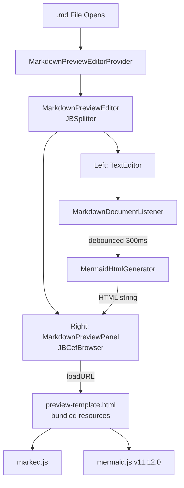

# Markdown Mermaid Preview Plugin — Architecture

## Overview

This plugin adds a live split-view preview panel inside Android Studio so developers can see rendered Markdown and Mermaid diagrams without leaving the IDE.

## Component Diagram

## Key Components

| Component | File | Responsibility |
|-----------|------|---------------|
| `MarkdownPreviewEditorProvider` | `editor/MarkdownPreviewEditorProvider.kt` | Detects `.md` files, creates the split editor |
| `MarkdownPreviewEditor` | `editor/MarkdownPreviewEditor.kt` | Hosts `JBSplitter` with text editor (left) + preview panel (right) |
| `MarkdownPreviewPanel` | `panel/MarkdownPreviewPanel.kt` | JCEF browser pane, exposes `updateContent()` |
| `MarkdownDocumentListener` | `listener/MarkdownDocumentListener.kt` | Listens to document edits, debounces at 300ms |
| `MermaidHtmlGenerator` | `renderer/MermaidHtmlGenerator.kt` | Utility for markdown pre-processing |
| `preview-template.html` | `resources/html/preview-template.html` | Browser page with marked.js + mermaid.js |
| `mermaid.min.js` | `resources/html/mermaid.min.js` | Bundled v11.12.0 (offline, no CDN) |
| `marked.min.js` | `resources/html/marked.min.js` | Bundled latest (offline, no CDN) |

## Data Flow

1. Developer opens a `.md` file in Android Studio
2. `MarkdownPreviewEditorProvider.accept()` returns `true` for `.md` extension
3. `MarkdownPreviewEditorProvider.createEditor()` constructs a `MarkdownPreviewEditor`
4. `MarkdownPreviewEditor` initialises a `JBSplitter` with `TextEditor` (left) and `MarkdownPreviewPanel` (right)
5. `MarkdownDocumentListener` is attached to the document and fires every time the document changes
6. After a 300ms debounce, the full document text is passed to `MarkdownPreviewPanel.updateContent()`
7. `updateContent()` executes `updateMarkdown(...)` JavaScript in the JCEF browser
8. The browser renders the Markdown via `marked.js` and processes Mermaid blocks via `mermaid.js v11.12.0`
